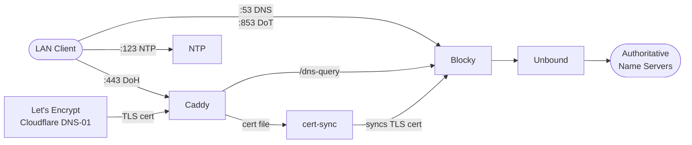

# home-dns

My home DNS and NTP server configuration. The Blocky project provides internal DNS services, encrypted DNS and custom host names and ad-blocking capabilities. Unbound provides the upstream DNS resolution, and is configured for either forwarding or recursive resolution. Caddy provides DNS/DoH/DoT support, allowing encrypted DNS within the LAN. This allows me to do things like split-DNS, multiple hostnames for same IP address, ad-blocking and adult content filtering, while having full control of how names resolve within my network and to the outside world with end to end encrypted DNS.

## DNS Privacy Decisions

There is a ton of debate on how to best secure DNS privacy, and I have tried to strike a balance between security and ease of use. This project provides an internal name server with support for traditional DNS (port `53`), DoT (port `853`) and DoH (port `443`), ensuring clients can prefer the most secure option they support. The internal name server can be configured to run as a recursive resolver or forward to upstream DoT providers, and I have chosen the latter for the reasons outlined below.

By default, the DNS server is configured to round-robin a selection of upstream DoT providers to spread the load, improve reliability as well as some privacy benefits. I've personally decided running as a recursive resolver is not worth the trade-offs as this causes a plaintext DNS query to be sent to the root nameservers, which is a privacy concern. Spreading across multiple DoT providers keeps the DNS encrypted while still providing some of the benefits of a recursive resolver, such as improved performance and reliability. Also, the DNS cache is far more likely to be warm at a major DoT provider than your private unbound instance, which can also improve performance and means lots of queries won't even need to reach the root nameservers.

### DNS-over-TLS vs DNS-over-HTTPS

There is further argument still between whether one should use DoT or DNS-over-HTTPS (DoH) for encrypted DNS. I have chosen to support both internally, but for upstreams I am only using DoT. The theoretical benefit of DoH is that it can be more difficult to block or throttle than DoT, as it uses the same port and protocol as regular HTTPS traffic. This is not a concern with my ISP, who will not block DoT on port `853`. If this was a concern, I would consider switching to DoH for upstream queries as well.

## Architecture



## Setup

1. Clone the repository and navigate to the project directory.

2. Create a `.env` file in the project and replace the placeholder values with your own:

    ```bash
    cp .env.example .env

    # Edit .env and replace the placeholder values with your own
    # For example:
    # DOH_SUBDOMAIN=dns.example.com
    # CADDY_DOMAIN=example.com  
    # ...
    ```

3. Run the following command to start the services:

```bash
    docker-compose up -d
```

## Usage

### NTP

The NTP server will be live at port `123` for time synchronization.

### DNS

The DNS server will be live at port `53` for traditional DNS queries.

### DNS-over-HTTPS (DoH)

The DoH server will be live at `https://<DOH_SUBDOMAIN>.<CADDY_DOMAIN>/dns-query` for encrypted DNS queries.

### DNS-over-TLS (DoT)

The DoT server will be live at port `853` for encrypted DNS queries. The TLS certificate for DoT is shared with the DoH server, so it will be valid for the same domain. The cert-sync service will ensure that the TLS certificate is kept up to date for both DoH and DoT.
