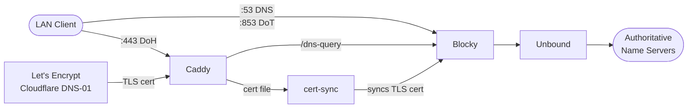

# home-dns

My home DNS and NTP server configuration. The Blocky project provides internal DNS services, encrypted DNS and custom host names and ad-blocking capabilities. Unbound provides the upstream DNS resolution, and is configured for recursive resolution. Caddy provides DoH support, allowing encrypted DNS within the LAN.

## Architecture



## Setup

1. Clone the repository and navigate to the project directory.

2. Create a `.env` file in the project and replace the placeholder values with your own:

    ```bash
    cp .env.example .env

    # Edit .env and replace the placeholder values with your own
    # For example:
    # DOH_SUBDOMAIN=dns.example.com
    # CADDY_DOMAIN=example.com  
    # ...
    ```

3. Run the following command to start the services:

```bash
    docker-compose up -d
```

## Usage

### NTP

The NTP server will be live at port `123` for time synchronization.

### DNS

The DNS server will be live at port `53` for traditional DNS queries.

### DNS-over-HTTPS (DoH)

The DoH server will be live at `https://<DOH_SUBDOMAIN>.<CADDY_DOMAIN>/dns-query` for encrypted DNS queries.

### DNS-over-TLS (DoT)

The DoT server will be live at port `853` for encrypted DNS queries. The TLS certificate for DoT is shared with the DoH server, so it will be valid for the same domain. The cert-sync service will ensure that the TLS certificate is kept up to date for both DoH and DoT.
